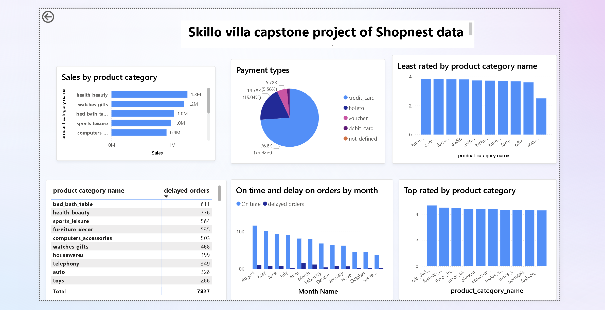
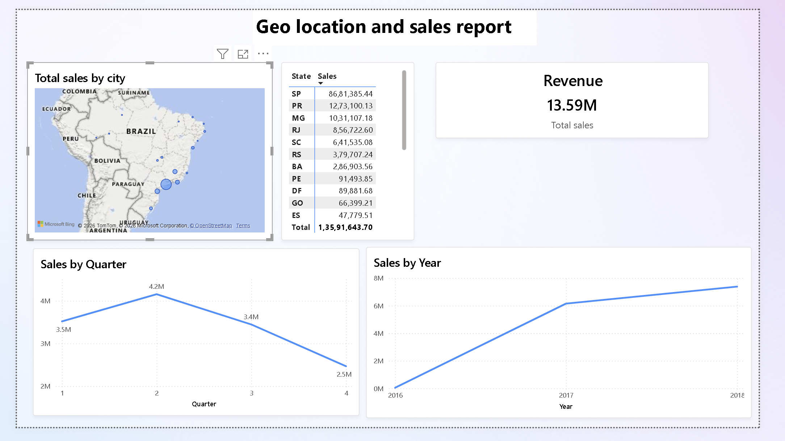

# Power BI Sales Analysis Dashboard (ShopNest)

## Overview

This project presents an interactive **Sales Analysis Dashboard** built using Power BI. It focuses on analyzing product performance, delivery efficiency, customer behavior, and regional sales trends.

Since `.pbix` files are large, this repository includes **dashboard previews (images)** and a **PDF report** for easy access.

## Objectives

* Identify top-performing product categories
* Analyze delayed vs on-time deliveries
* Understand customer payment behavior
* Evaluate product ratings (top & bottom)
* Analyze regional sales performance
* Identify seasonal sales trends
* Track revenue growth over time

## Key Insights

* Health & Beauty is the top-performing category, while Garden Tools ranks lowest
* Bed, Bath & Table has the highest delayed orders
* Sales peak during **Quarter 2**, showing seasonal trends
* Credit Card is the most used payment method
* São Paulo has the highest sales, while Rio Branco has the lowest
* Revenue shows consistent growth from 2016 to 2018

## Dashboard Preview

### Dashboard View 1

### Dashboard View 2

## Full Dashboard Report (PDF)

👉 [View Complete Dashboard PDF](pdf-file/shopnest_dashboard_pdf.pdf)

## Tools Used

* Power BI
* Data Visualization
* Business Intelligence

## Project Structure

* images/ → Dashboard screenshots
* pdf-file/ → Full dashboard report
* README.md

## Conclusion

This project demonstrates how business intelligence tools like Power BI can transform raw data into meaningful insights, helping organizations improve decision-making and performance tracking.
